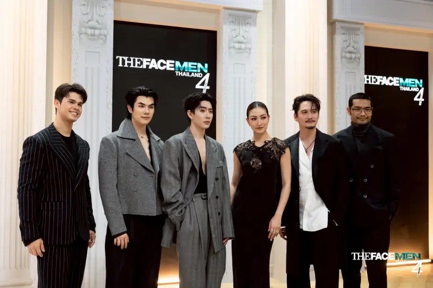

# THE FACE AI



An AI casting-room app inspired by **The Face** — hit the camera, get mentor-style pose challenges, snap under pressure, then get scored like you’re standing in front of the panel.

## What it does

1. **Start the shoot** — press Camera and your webcam goes live  
2. **Get the brief** — three random modeling directions (serious, sexy, casual, powerful, etc.)  
3. **Countdown** — `5…4…3…2…1` then auto-capture  
4. **Mentor review** — OpenAI Vision grades each pose against its instruction  
5. **See the book** — each photo shows with a score and punchy feedback  

Beach Labubus still hang out on the runway for chaos energy. You can spawn more (clears at 20).

## Stack

- React + Vite  
- Webcam capture in the browser  
- OpenAI Vision (`gpt-4o-mini`) for pose evaluation  

## Setup

```bash
npm install
```

Create a `.env` file (see `.env.example`):

```
VITE_OPENAI_API_KEY=your_key_here
```

Then run:

```bash
npm run dev
```

Open [http://localhost:5173](http://localhost:5173).

> Keep your API key in `.env` only — it is gitignored and should never be committed.

## Project vibe

Black studio. Teal accents. Big **THE FACE** branding. Casting-room energy — not a generic webcam demo.
